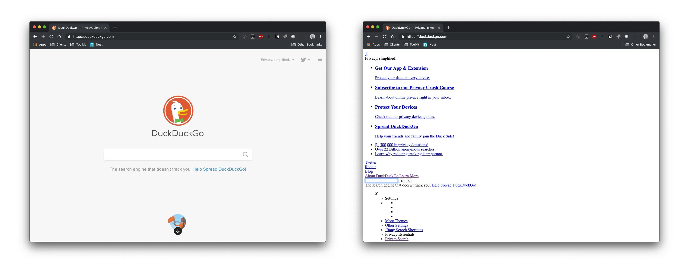

# css Grammar

css는 Cascading Style Sheets 의 약어로 html의 다양한 요소들을 꾸미고 또 최적화를 하는 것을 도와주는 언어다. css를 적용 하는 것이 필수 인 이유는 다음과 같다.
정말 못생겼다. 정말 못생기기도 했고 가독성이 상당히 떨어져서 어디에 어떤 요소가 있는 지 조차도 알아볼수 없다. 그렇기 때문에 시인성을 위해서라도 css를 적용하는 것은 필수다.
> 
> 웹사이트 DuckDuckGo를 css적용을 해지한 모습이다. <br/>
> 출처: https://css-tricks.com/that-time-i-tried-browsing-the-web-without-css/

그렇다면 이 css를 어떻게 작성하는지 또 어떻게 적용을 시키는지 알아보았다.

## css grammar

css는 사실 문법이라고 해봐야 간단하다 아래와 같은 룰을 적용 시켜주면서 적용을 시켜주면 끝이다.
```css
ElementsName{Attribute: value;}
```
위와 같이 요소이름을 작성후 중괄호를 열어 안에 속성과 속성 값을 작성하고 그 마무리로 쉼표를 달아주면 끝이다. 저렇게 하면 하나의 속성이 해당하는 요소에 적용되며 조금은 더 예쁘게 작성할수 있게 도와준다.

>```css
> div{
>color: red;
>background-color: black;
> }
>```
>

## 4 ways to apply css

그냥 css를 문법에 맞춰서 작성을 했다고 다가 아니다. css를 html에 적용을 시켜줘야 하는데 그 방법이 총 4가지가 있다.

1. 내장방식: 말 그대로 html문서 안에 내장을 시키는 방식이다. 해당하는 방식은 다음과 같이 적용할 수 있다. html 문서의 head부분에 `<style></style>` 이 태그 안에 작성을 하면 적용이 알아서 된다.
2. 인라인방식: html의 속성편에서도 있었지만 요소의 전역 속성중 `<div style=""></div>` style 속성을 사용하면 요소에 직접 스타일을 적용 할 수 있다. 하지만 이렇게 일일이 작성하기 보다는 css파일을 만들어서 html에 적용을 시키는 것이 보기에도 편하고 유지보수가 쉬운 관계로 추천하지 않는다.
3. 링크방식: html의 head 태그중 `<link rel="stylesheet" herf="style.css" />`를 이용하여 외부의 css 파일을 가져와 적용을 시키는 방식이다. 대부분 많이 사용하는 방식이다.
4. @import 방식: css의 import규칙을 사용하여 css안에 또 다른 css파일을 연결을 시켜주는 방식이다. css끼리 css파일을 다운 받고 적용시키는 과정에서 별도의 딜레이가 발생 될수있다.

----
## 느낀점
css를 작성하면서 css문법과 또 적용시키는 방법에 대해서 크게 생각을 해보지 않았었는데 다시한번 상기되어서 내가 원하는 또 상황에 어울리는 적용법을 사용을 하는 것이 좋겠다.