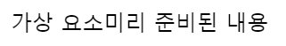
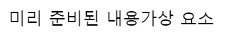

# css selector

오늘은 css selector 와 스타일의 상속의 개념 그리고 선택자 우선순위에 대해서 배웠다. css selector는 원하는 스타일을 적용을 시킬 수 있는 방법이고 선택자는 크게 5가지로 분류 할 수 있다. 바로 기본 선택자, 복합 선택자, 가상 클래스, 가상 요소, 속성이 있다.

## 기본 선택자
 ```css
*{
    color: red;
}
body{
    color: red;
}
.class{
    color: red;
}
#id{
    color: red;
}
```
기본 선택자는 위에 있는 것 처럼 작성한다. 
- `*{ color: red; }` : 모든 요소에 적용을 하는 선택자이다.
- `body{ color: red; }` : 태그 이름을 적었을 시 해당하는 태그에 적용을 하는 선택자이다.
- `.class{ color: red; }` : 클래스 이름을 적었을 시 해당하는 클래스에 적용을 하는 선택자이다.
- `#id{ color: red; }` : 아이디 이름을 적었을 시 해당하는 아이디에 적용을 하는 선택자이다.
## 복합 선택자

 복합 선택자는 기본 선택자를 조합하여 사용하는 선택자이다. 그래서 내가 원하는 요소를 찾고 또 스타일을 적용시킬 때 사용한다. 어떤 것들이 있는지 알아보자.
```css
div.class{
    color: red;
}
div > .class{
    color: red;
}
div .class{
    color: red;
}
div + .class{
    color: red;
}
div ~ .class{
    color: red;
}
```

- `div.class{ color: red; }` : 일치선택자라고 불리며 선택자 div와 .class를 동시에 만족하는 요소를 선택해주는 선택자이다. 다만 클래스를 선택자를 앞에서 적는 경우에는 `.classspan{ color: red; }` 해당하는 클래스를 찾으니 주의해야 한다.
- `div > .class{ color: red; }` : 자식선태자라고 불리며 선택자 div의 자식 요소 중 .class를 만족하는 요소를 선택해주는 선택자이다. 앞서서 언급했던 자식관계를 생각해보면 된다. 중복되는 클래스의 이름을 사용하고 있지만 자식관계인 요소만 찾아준다.
- `div .class{ color: red; }` : 하위선택자라고 불리며 선택자 div의 하위 요소 중 .class를 만족하는 요소를 선택해주는 선택자이다. 후손관계에 속해있는 요소를 찾아주기 때문에 중복되는 클래스 혹은 요소가 있으면 모두 찾아준다. 아래의 예시를 보면 단번에 이해 할 수 있다.
```html
<div>
    <div class="class">선택됨</div>
    <div>선택 안됨</div>
    <ul>
        <li class="class">선택 됨</li>
    </ul>
</div>
<div class="class">선택 안됨</div>
```
- `div + .class{ color: red; }` : 인접형제선택자라고 불리며 선택자 div의 다음 형제 요소 중 .class를 만족하는 요소를 하나를 선택해주는 선택자이다. 아래의 예시를 보면 알 수 있다.
```html
<div>
    <span class="class">선택 됨</span>
    <div>
        <span class="class">선택 됨</span>
    </div>
</div> 
```
- `div ~ .class{ color: red; }` : 일반형제선택자라고 불리며 선택자 div의 다음 형제 요소 중 .class를 만족하는 요소를 모두 선택해주는 선택자이다.
## 가상 클래스 선택자

가상 클래스 선택자는 요소의 특정한 상태를 선택 해주는 선택자이다. 가상 클래스 선택자는 선택자 뒤에 `:`를 붙여서 사용한다. css의 가상 클래스 선택자는 css를 이용해서 웹페이지를 더욱 다채로운 효과를 내줄 수 있다. 가상 클래스 선택자는 종류가 워낙 방대하고 많기 때문에 모두 다루는 것은 무리이고 자주 사용하는 것 몇가지만 다루도록 하겠다.
```css
div:hover{
    color: red; 
} 
div:active{
    color: red; 
} 
input:focus{ 
    color: red;
}
.class span:first-child{ 
    color: red;
}
.class span:last-child{
    color: red;
}
.class span:nth-child(2){
    color: red;
}
.class *:not(span){
    color: red;
}
```

- `div:hover{ color: red; }` : 마우스가 해당하는 요소 위에 있으면 작동하는 선택자이다. 마우스가 요소 위에 있을 때만 적용되기 때문에 마우스가 요소 위에 있지 않으면 적용되지 않는다.
- `div:active{ color: red; }` : 마우스가 해당하는 요소를 클릭을 하면 작동하는 선택자이다. 실제로 마우스가 클릭이 되고 있는 동안에만 적용이 된다.
- `input:focus{ color: red; }` : 해당하는 요소가 포커스 상태 즉 선택되어 있거나 해당하는 요소를 통해 입력 또는 무언가 행동을 할때 적용 되는 선택자이다. 주로 input 태그에 사용된다. 추가적으로 포커스 상태는 한번에 하나의 요소만 가능하다.
- `.class span:first-child{ color: red; }` : 선택자 span의 형제의 요소중 맨 첫번째 요소를 선택해주는 선택자이다. 글로는 헷갈릴 수도 있으니 아래의 예시를 통해 알아보자.
```html
<div class="class">
    <span>선택 됨</span>
    <span>선택 안됨</span>
    <p>선택 안됨</p>
</div>
```
- `.class span:last-child{ color: red; }` : 선택자 span의 형제의 요소중 맨 마지막 요소를 선택해주는 선택자이다. 이 역시 글로는 헷갈릴 수도 있으니 아래의 예시를 통해 알아보자.
```html
<div class="class">
    <span>선택 안됨</span>
    <span>선택 됨</span>
    <p>선택 안됨</p>
</div>
```
- `.class span:nth-child(2){ color: red; }` : 선택자 요소의 형제의 요소중 2번째 요소를 선택해주는 선택자이다. 이 선택자의 경우 n을 사용하여 응용 할수도이다. 아래의 예시를 보자
```css
.class span:nth-child(2n){ 
    /*2의 배수 요소에 적용*/
    color: red;
} 
.class span:nth-child(2n+1){ 
    /* 홀수번인 요소에만 적용 */
    color: red; 
}
.class span:nth-child(2n+2){
    /* 짝수번인 요소에만 적용 */
    color: red; 
} 
.class span:nth-child(n+2){
    /* 2번쨰 이상인 요소에만 적용 */
    color: red; 
}
```
참고로 n은 0부터 시작하기 때문에 주의하자!

- `.class *:not(span){ color: red; }` : 부정 선택자라고도 불리며, 해당하는 선택자가 아닌 요소를 선택하는 선택자이다. 그렇게 많이 사용되는 것은 아니지만, 알아두면 언젠간 쓸 수 있을 수도 있다.
## 가상 요소 선택자

가상 요소 선택자는 선택자의 일종으로, 선택된 요소에 가상의 요소를 삽입을 할 수 있는 요소이다. 가상 요소 선택자는 선택자 앞에 "::"를 붙여 사용할 수 있으며 꽤 자주 사용되는 선택자이다.
```css
.class::before{
    content: "가상 요소";
}
.class::after{
    content: "가상 요소";
}
```

그리고 공통적으로 가상 선택자에 content 부분을 입력하지 않으면 자동으로 생략이 되기 때문에 항상 content를 입력해주는 것이 좋다.

- `.class::before{ content: "가상 요소"; }` : 선택자의 앞에 가상 요소를 인라인형태로 삽입해주는 선택자이다. 아래의 예시를 보자.
```html
<body><div>미리 준비된 내용</div></body>
<style>
    body::before{
        content: "가상 요소";
    }
</style>
```

- `.class::after{ content: "가상 요소"; }` : 선택자의 뒤에 가상 요소를 인라인형태로 삽입해주는 선택자이다. 이 역시 아래의 예시를 보자.
```html
<body><div>미리 준비된 내용</div></body>
<style>
    body::after{
        content: "가상 요소";
    }
</style>
```

## 속성 선택자

속성 선택자는 선택자의 일종으로, 선택된 요소의 속성을 기준으로 선택하는 선택자이다. 속성 선택자는 선택자 앞에 "[]"을 붙여 사용할 수 있다. 아래의 예시를 보면 이해 할 수 있다.
```css
[attribute]{
    /* attribute 라는 속성을 가진 요소에 적용 */
    color: red;
}
[attribute="value"]{
    /* attribute 속성에 value 라는 값을 가진 요소에 적용 */
    color: red;
}
```

## 스타일의 상속

 어떤 스타일들을 부모에게서 상속을 받을 수 있다. 즉 내가 부모에게 스타일을 적용을 시켰다면 자식에게도 똑같이 적용이 된다는 내용이다. 하지만 모든 스타일이 상속이 되지는 않는다.
 상속이 되는 스타일들은 글자 모양, 글자 두께, 글자 크키 및 색상 줄 높이 등등 대부분 글자에 관련한 것들만 상속을 받을 수 있습니다.
 하지만 상속이 되지 않는 스타일들을 강제적으로 상속을 받게 만들 수 있는데, 바로 `inherit` 속성을 사용하면 된다.
 inherit 속성은 부모의 스타일을 자식에게 상속을 받게 만들어주는 속성이다. 그래서 비록 자식에게는 상속이 되지 않는 스타일이라고 해도 inherit 속성을 사용하면 부모의 스타일을 자식에게 상속을 받게 만들 수 있다.
```html
<body>
    <div></div>
</body>
<style>
    body{
        color: red;
     background-color: yellowgreen;
    }
    div{
        background-color: inherit;
    }
</style>
```

## 선택자의 우선순위
 선택자는 우선순위가 있다. 우선순위가 높은 선택자가 우선적으로 적용이 된다. 우선순위는 아래와 같다.
1. `!important` : 가장 우선순위가 높다. `!important`를 사용하면 해당하는 스타일이 가장 먼저 적용 된다.
2. 인라인 스타일 : 인라인 스타일은 우선순위가 두번째로 높다. 인라인을 스타일을 사용한다. 해당하는 스타일이 직접 적용이 된다.
3. 아이디 선택자 : 아이디 선택자는 우선순위가 세번째로 높다. 
4. 클래스 선택자 : 클래스 선택자는 우선순위가 네번째로 높다.
5. 태그 선택자 : 태그 선택자는 우선순위가 다섯번째로 높다.
6. `*` 선택자 : `*` 선택자는 우선순위가 가장 낮다. `*` 선택자는 모든 요소에 적용이 되기 때문에 우선순위가 가장 낮다.
7. 상속 : 상속은 우선순위에 포함되지 않는다. 상속은 그냥 상속을 받는 개념이기 때문이다.
위의 우선순위를 코드로 나타내보면 다음과 같다.
```html
<body>
    <div style="color: blue" id="id" class="class">Content</div>
</body>
```
```css
div{
    color: red !important;
}
#id{
    color: green;
}
.class{
    color: yellow;
}
div{
    color: orange;
}
*{
    color: black;
}
body{
    color: white;
}body
```


위의 코드를 적용을 시켰을 때 실제로 적용되는 스타일은 `!important` 가 적용되어있는 `color: red !important;` 가 우선적으로 적용되며 그 다음으로는 인라인 선택자, 그 뒤 차례대로 id class div * 순으로 적용이 된다.

다만 추가적으로 같은 우선순위에 있을 경우에는 css는 위에서 아래로 코드를 읽고 적용이 되는 언어이기 때문에 가장 마지막에 적은 스타일이 적용된다. 이를 생각하면서 스타일 작업을 이어나가자.

----
# 마무리하면서..
이번 TIL에서는 css의 기본적인 선택자의 개념과 또 그 에 대한 것들 그리고 스타일의 상속과 선택자들의 우선순위에 대해서 알아보았습니다. 
제가 스타일을 적용을 하면서 어 이거는 왜 적용이 안되지? 라는 생각이 들 때가 많았고 또 그로 인해서 불편함이 있었지만 선택자들과 우선순위에 대한 개념을 제대로 알고 또 적용을 하니까 조금은 편하게 작업을 할 수 있었 던 것 같습니다.