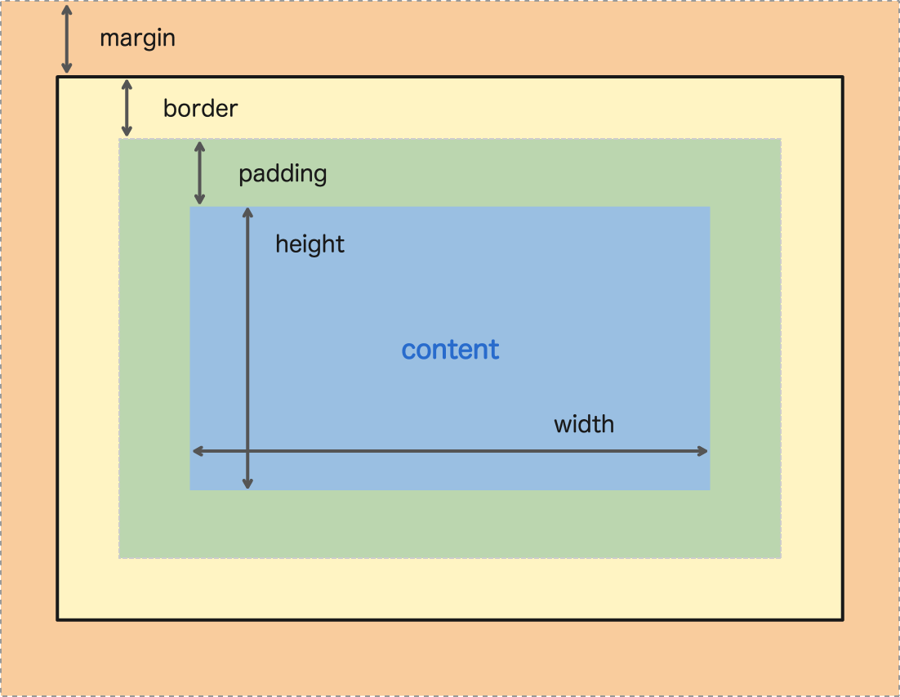
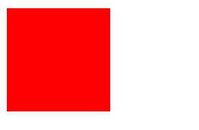
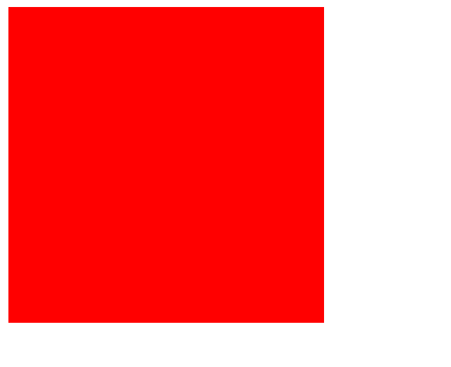
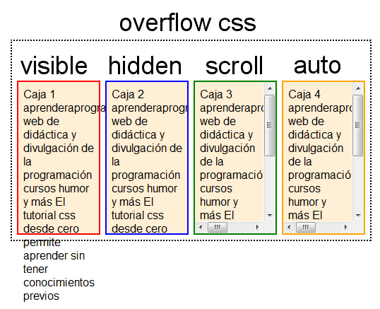
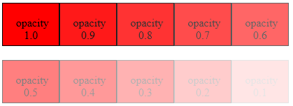

# css Property

오늘은 css의 속성의 종류와 또 여러가지의 속성 그리고 css에 자주 사용되는 단위 및 색 표현을 알아보았습니다.

## css 단위

css는 크기를 표현하는 단위를 사용할때 다음과 같은 단위를 사용하여 해당하는 크기를 표현한다. 절대적인 단위와 상대적인 단위가 있습니다만, 절대적인 단위는 뒤에 언급한 px이 유일하며 나머지는 상대적인 크기를 표현하는 단위입니다.

- px : 픽셀입니다. 픽셀은 화면에 표현되는 작은 단위를 의미한다. 주로 사용자의 환경에 따라서 다르지만 주로 세로 1920px 가로 1080px 정도의 크기를 가집니다. 그리고 유일하게 절대적인 크기를 가지는 단위이다.
- % : 퍼센트입니다. 부모 요소의 크기를 기준으로 크기를 표현합니다. 예를 들어서 부모의 크기가 100px이고 자식의 크기가 50%라면 자식의 크기는 50px이 된다. 
- em: em은 상대적인 크기를 나타내는 단위입니다. em은 부모 요소의 폰트크기를 기준으로 크기를 표현합니다. 예를 들어서 부모의 폰트크기가 15px이고 자식의 크기를 표현하는 단위가 2em 이라면 30px이 된다.
- rem: rem역시 마찬가지로 em과 마찬가지로 상대적인 크기를 나타내는 단위입니다. 대신 em은 부모의 폰트크기를 따라서 크기가 바뀌었다면 rem은 루트 요소의 크기 즉 html 요소의 폰트크기에 따라서 크기가 바뀐다. 예를 들어서 html 폰트크기가 15px이고 자식의 크기를 표현하는 단위가 2rem 이라면 30px이 된다.
- vw: vw는 viewport-width로 사용자의 뷰포트의 너비를 기준으로 크기를 표현합니다. 즉 사용자가 보고 있는 화면의 가로 크기를 기준으로 크기를 표현하며, 100vw는 현재 화면의 가로 크기를 의미한다. 50vw는 현재 화면의 가로 크기의 절반을 의미한다.
- vh: vh는 viewport-height로 사용자의 뷰포트의 높이를 기준으로 크기를 표현합니다. 위와 마찬가지로 사용자의 세로 크기에 맞춰서 크기가 변하며 , 100vh는 현재 화면의 세로 크기를 의미한다. 50vh는 현재 화면의 세로 크기의 절반을 의미한다.

## css 색 표현 방식

css는 위와 마찬가지로 크기와 마찬가지로 색을 표현을 하는데 여러가지의 방식이 있습니다. 그 예시를 보겠습니다.

- 색상 이름: 브라우저에서 기본적으로 제공하는 색상이름이다. 예를 들어 tomato, blue, yellow 등이 있다. 브라우저 마다 지원하는 색상이 다를 수 있어서 절대적인 값을 원한다면 사용하지 않는 것이 좋다.
- HEX 색상: 16진수를 시용한 색깔 표현이며 `#` 을 이용하여 표현한다.
- RGB 색상: RGB 색상은 빨강(red), 초록(green), 파랑(blue)의 약자로 색상을 표현하는 방식이다. 각자의 색상에 0~255 까지로 표현하며 익히 사용되는 코드이다. 예를 들어 `rgb(255, 0, 0)` 은 빨간색을 의미한다.
- RGBA 색상: RGBA 색상은 RGB 색상에 알파값 즉 투명도를 추가한 것으로 `rgb(255, 0, 0, 0.5)` 와 같이 사용한다. 알파값은 0~1 사이의 값을 가지며 0은 완전히 투명, 1은 완전 불투명을 의미한다.

## css 속성

css는 브라우저를 스타일링 하기 위해 만들어 졌으며 수 많은 속성들을 통해서 브라우저를 스타일링 할 수 있다. 먼저 어떤 종류가 있는 지 부터 알아보자.

1. 박스 모델 속성
2. 글꼴, 문자 즉 텍스트 관련 속성
3. 배경 관련 속성
4. 배치 관련 속성
5. 정렬 관련 속성
6. 전환 관련 속성
7. 변환 관련 속성
8. 애니메이션 관련 속성
9. 기타 속성 등

위의 9가지의 종류 외에도 다양한 속성들이 있으며 이를 통해 브라우저를 스타일링 할 수 있다. 그렇다면 위의 종류들 중에서 어떤 것을 자주 사용하고 또 유용하게 사용할 수 있는지 알아보자.

### 박스 모델 속성

박스 모델 속성은 브라우저를 구성하는 요소들을 하나의 박스로 설정하며 이를 통해 해당하는 요소의 크기, 여백, 테두리 등을 설정 할 수 있다. 이를 통해 브라우저를 구성하는 요소들을 예쁘게 꾸밀 수 있다.

```css
.box {
    width: 100px;
    height: 100px;
    margin: 10px;
    padding: 10px;
    border: 1px solid black;
    border-radius: 10px;
    box-shadow: 10px 10px 5px #888888;
}
```

위의 width부터 어떤 것을 의미 하는 지 차근차근 알아보자.

- `width: 100px;` 요소의 너비를 설정한다. 말그대로 해당 하는 요소의 너비를 설정한다. 기본값은 auto이며 auto는 인라인의 요소의 경우 해당 요소의 내용에 따라서 너비가 결정된다. 블록 요소인 경우에는 최대한 늘어날 수 있는 만큼 늘어난다.
- `height: 100px;` 요소의 높이를 설정한다. width와 마찬가지로 해당 요소의 높이를 설정한다. 기본값은 auto이며 auto는 인라인 요소 블록 요소 상관 없이 내용에 따라서 높이가 결정되며 최대한 내용에 맞춰서 줄어들려고 한다.
- `margin: 10px;` 요소의 여백을 설정한다. margin은 요소의 여백을 설정한다. 여백은 요소의 바깥쪽에 있는 여백을 의미한다. 여백은 상하좌우로 구분되며 각각의 여백을 설정할 수 있다. `margin: 10px;` 이라고 설정하면 상하좌우 모두 10px의 여백이 설정된다. `margin: 10px 20px;` 이라고 설정하면 상하는 10px, 좌우는 20px의 여백이 설정된다. `margin: 10px 20px 30px;` 이라고 설정하면 상은 10px, 좌우는 20px, 하는 30px의 여백이 설정된다. 4개로 설정 했을 경우에는 위에서 부터 시계방향으로 생각하면 편하다. 예를들어서 `margin: 10px 20px 30px 40px;` 이라고 설정하면 상은 10px, 우는 20px, 하는 30px, 좌는 40px의 여백이 설정된다. 또한 각각의 코드 예를 들어 위에만 여백을 주고 싶다면 `margin-top: 10px;` 이라고 설정하면 된다.
- `padding: 10px;` 요소의 내부 여백을 설정한다. 내부 요소는 요소 안쪽에 있는 너비를 의미한다. margin과 마찬가지로 상하좌우 별도로 설정 해줄수도 있다. 방식은 위와 동일하다.
- `border: 1px solid black;` 요소의 테두리를 설정한다. 테두리는 요소의 외각선을 의미하며, margin과 padding과 마찬가지로 상하좌우 별도로 설정 해줄수도 있다. 그리고 각각 개별로 색상 그리고 요소의 테두리의 선의 종류를 선택해 줄수도 있다.
- `border-radius: 10px;` 요소의 테두리의 모서리를 둥글게 만든다. border-radius는 요소의 테두리의 모서리를 둥글게 만든다. 기본값은 0이며 0이 아닌 값이 설정되면 요소의 테두리의 모서리가 둥글게 된다. 또한 각각의 모서리를 개별로 설정해줄수도 있으며 방식은 margin과 마찬가지이다.
- `box-shadow: 10px 10px 5px #888888;` 요소의 그림자를 설정한다. box-shadow는 요소의 그림자를 설정한다. 기본값은 none이며 none이 아닌 값이 설정되면 요소에 그림자가 생긴다. 그림자의 위치를 설정해 줄수도 있으며 그림자의 흐림 정도를 설정해 줄수도 있다 게다가 그림자의 색상을 설정해 줄수도 있다.

> 
> 위의 margin, padding, border를 표현한 그림
> 출처: https://sabe.io/classes/css/css-box-model-padding-border-margin

#### Box-sizing

css를 작업을 하다보면 때때로 padding을 넣거나 border를 넣게 되면 내가 원하지 않는 방향으로 흘러갈수도 있다. 예를 들어서 아래와 같은 코드 및 사진을 보자.

```css
div {
  width: 100px;
  height: 100px;
  background-color: red;
}
```


만약에 내가 이상태에서 padding을 100px 넣었다고 가정해보자.
  
  ```css
div {
  width: 100px;
  height: 100px;
  background-color: red;
  padding: 100px;
}
```


패딩을 넣은 값 만큼 커져버렸다. 그 이유는 단순하다 padding을 넣으면 요소의 너비와 높이가 커지기 때문이다. 그렇다면 이를 해결하기 위해서는 어떻게 해야할까? 그것은 box-sizing을 사용하면 된다.
box-sizing은 박스의 크기를 계산하는 방식이며 기본값은 content-box이다. content-box는 요소의 너비와 높이를 계산할때 padding과 border를 더하지 않는다. 그렇다면 padding과 border를 더하려면 어떻게 해야할까? 그것은 border-box이다. border-box는 요소의 너비와 높이를 계산할때 padding과 border를 더한다. 그렇다면 이를 적용해보자.


```css
div {
  width: 100px;
  height: 100px;
  background-color: red;
  padding: 100px;
  box-sizing: border-box;
}
```


이렇게 padding을 넣어도 요소의 크기가 최종적으로 100px를 넘지 않게 된다. 이렇게 box-sizing을 사용하면 요소의 크기를 계산할때 padding과 border를 더할지 더하지 않을지 결정할수 있다.

#### overflow 속성, display 속성

overflow 속성은 요소의 내용이 넘쳤을때 어떻게 처리할지를 결정하는 속성이다. 기본값은 visible이며 visible이 아닌 값이 설정되면 요소의 내용이 넘쳤을때 처리방식이 결정된다. visible은 요소의 내용이 넘쳐도 그대로 보여준다. hidden은 요소의 내용이 넘쳐도 보여주지 않는다. scroll은 요소의 내용이 넘쳐도 스크롤바를 통해 보여준다. auto는 요소의 내용이 넘쳐도 스크롤바를 통해 보여주지만 스크롤바가 필요없을때는 보여주지 않는다.
>
> 오버플로우 속성에 관련한 것을 한눈에 보는 그림
> 출처: https://webdir.tistory.com/347

display 속성은 요소를 어떻게 보여줄지 정하는 속성이다. 기본값은 요소에 따라서 달라지며 요소에 따라서 다른 값이 설정될 수 있다. block은 요소를 블록레벨 요소로 만들어 준다. inline은 요소를 인라인 요소로 만들어 준다. inline-block은 요소를 인라인 블록 요소로 만들어 준다. none은 요소를 보여주지 않는다. 그리고 후에 배울 정렬(flex) 속성 그리드 속성등등 이것을 이용하여 설정해줄수 있다.

#### opacity 속성

요소의 투명도를 설정해줄 수 있는 속성이다. 기본값은 1이며 0~1사이의 값을 설정할 수 있다. 0은 완전히 투명하고 1은 완전히 불투명하다. 
> 
> opacity 속성에 관련한 것을 한눈에 보는 그림
> 출처: https://webclub.tistory.com/231

### 글꼴 문자, 즉 텍스트 관련 속성

css는 텍스트에 대해서도 상당히 많은 속성을 제공한다. 그렇다면 위의 속성들을 알아보자.

```css
p {
    
    font-family: "맑은 고딕", "Malgun Gothic", "돋움", "Dotum", sans-serif;
    font-size: 20px;
    font-weight: bold;
    line-height: 1.5;
    letter-spacing: 2px;
    text-align: center;
    text-decoration: underline;
    text-indent: 20px;
    color: red;
}
```

- `font-family: "맑은 고딕", "Malgun Gothic", "돋움", "Dotum", sans-serif;` font-family 속성이다. 글자의 글꼴을 설정해줄수 있는 속성이며. 앞에 있는 글꼴 부터 순차적으로 적용 되고, 모두 적용하지 못했다면 맨 마지막에 있는 표준 글꼴이 적용이 된다.
- `font-size: 20px;` font-size 속성이다. 글자의 크기를 설정해줄수 있는 속성이다. 기본값은 16px이며 px, em, rem 등등의 단위를 사용할 수 있다.
- `font-weight: bold;` font-weight 속성이다. 글자의 굵기를 설정해줄수 있는 속성이다. 기본값은 normal이며 bold, bolder, lighter, 100~900까지의 숫자를 사용하여 표현 할 수도 있다.
- `line-height: 1.5;` line-height 속성이다. 글자의 줄간격을 설정해줄수 있는 속성이다. 글자 크기를 기준으로 높이를 가지며 속성으로 기본 숫자를 설정했을 경우에 숫지의 배율로 줄 간격이 결정된다. 기본값은 normal이며 px, em, rem 등등의 단위를 사용할 수 있다.
- `letter-spacing: 2px;` letter-spacing 속성이다. 글자의 자간을 설정해줄수 있는 속성이다.
- `text-align: center;` text-align 속성이다. 글자의 정렬을 설정해줄수 있는 속성이다. 기본값은 left이며 center, right, justify를 사용할 수 있다.
- `text-decoration: underline;` text-decoration 속성이다. 글자에 밑줄을 설정해줄수 있는 속성이다. 기본값은 none이며 underline, overline, line-through을 사용할 수 있다.
- `text-indent: 20px;` text-indent 속성이다. 글자의 들여쓰기 크기를 설정하는 속성이다. 기본값은 0이며 px, em, rem 등등의 단위를 사용할 수 있다.
-  `color: red;` color 속성이다. 글자의 색상을 설정해줄수 있는 속성이다. 기본값은 black css의 색을 정하는 값으로 설정해줄수 있다.

### 배경 관련 속성

배경 관련 속성은 말 그대로 해당하는 요소의 배경에 관련된 속성이다. 배경 관련 속성은 다음과 같다.

```css
div {
    background-color: #fff;
    background-image: url("https://google.com/favicon.ico");
    background-size: 100px 100px;
    background-repeat: no-repeat;
    background-position: center;
    background-attachment: fixed;
}
```

- `background-color: #fff;` background-color 속성이다. 배경의 색상을 설정해줄수 있는 속성이다. 기본값은 transparent이며 css의 색을 정하는 값으로 설정해줄수 있다.
- `background-image: url("https://www.google.com/favicon.ico");` background-image 속성이다. 배경의 이미지를 설정해줄수 있는 속성이다. 기본값은 none이며 url을 사용하여 이미지를 설정해줄수 있다.
- `background-size: 100px 100px;` background-size 속성이다. 배경의 크기를 설정해줄수 있는 속성이다. 기본값은 auto이며 px, em, rem 등등의 단위를 사용할 수 있다.
- `background-repeat: no-repeat;` background-repeat 속성이다. 배경의 반복을 설정해줄수 있는 속성이다. 기본값은 repeat이며 repeat, repeat-x, repeat-y, no-repeat을 사용할 수 있다.
- `background-position: center;` background-position 속성이다. 배경의 위치를 설정해줄수 있는 속성이다. 기본 값은 0% 이며 center, top, bottom, left, right의 방향을 나타내는 영어로도 표현할수 있으며 px, em, rem 등등의 단위를 사용할 수 있다.
- `background-attachment: fixed;` background-attachment 속성이다. 배경의 고정을 설정해줄수 있는 속성이다. 기본값은 scroll이며 fixed, local을 사용할 수 있다.

오늘은 이렇게 배웠습니다. 내일은 마저 다루지 않은 속성인 배치관련 속성부터 시작하여 다루겠습니다.

---
# 느낀점

css에서 다양하게 사용하는 속성들이 있는데 내가 알고 있던 속성을 사용하는 방법이 사실 잘못 사용하고 있었고 또 바르지 못하게 사용하고 있었던 부분이 있었던 걸 알게 되었습니다.
