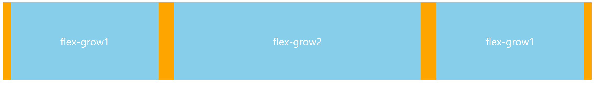

# CSS Property 2

오늘은 어제의 시간에 이어서 다루지 못한 CSS Property에 대해 알아보도록 하겠습니다.
오늘 다뤄볼 CSS Property는 다음과 같다.

1. 배치 관련 속성
2. 정렬 관련 속성
3. 전환 관련 속성
4. 변환 관련 속성

## 1. 배치 관련 속성

### position

position 속성은 요소의 위치를 정하는 속성이다. position 속성은 다음과 같은 속성을 가질수 있다.
```css
div{
    position: static;
    position: relative;
    position: absolute;
    position: fixed;
    position: sticky;
}
```

참고 사항으로 position 속성은 static을 제외하고는 다른 속성과 함께 사용된다. 그 속성들은 각각 다음과 같다. `top`, `right`, `bottom`, `left` 이며, 이 속성들은 position 속성과 함께 사용되어 요소의 위치를 조정한다. 값으로는 px, %, em 등이 들어갈 수 있다.

- `static` : 기본값으로, 요소의 위치를 지정하지 않는다. 즉, 요소의 위치는 문서의 흐름에 따라서 배치된다.
- `relative` : 요소의 자신을 기준으로 위치를 지정한다. 요소의 위치는 문서의 흐름에 따라서 배치가 되지만, 요소의 위치를 지정하게 되면 지정한 만큼 이동을 하게 된다. 
- `absolute` : 요소의 가장 가까운 조상 요소를 기준으로 위치를 지정한다. 조상 요소의 위치에 따라서 요소의 위치가 달라진다. 조상 요소를 설정하는 방법은 조상요소에 `position: realtive`를 설정해주면, 설정된 요소에 맞추어서 위치가 조정된다. 만약 조상 요소가 없다면, `body`를 기준으로 위치를 지정한다.
- `fixed` : 요소의 뷰포트를 기준으로 위치를 지정한다. 뷰포트는 사용자가 보는 화면을 의미한다. 즉, 스크롤을 해도 요소의 위치가 변하지 않는다. 주로 고정을 해야하는 요소 내비게이션 바 등에 사용된다. 
- `sticky` : 요소의 위치를 지정한다. `sticky`는 `relative`와 `fixed`의 조합으로, 요소의 위치를 지정하고, 스크롤을 내리면 `fixed`처럼 고정이 되고, 스크롤을 올리면 `relative`처럼 원래 위치로 돌아간다. 
> 
>  position: static | position: relative | position: absolute | position: fixed 를 한눈에 볼 수 있는 그림
> 출처: https://medium.com/analytics-vidhya/positioning-with-css-baede745e1d9

### 쌓임 맥락 (z-index)

z-index는 요소의 쌓임 맥락을 지정하는 속성이다. 쌓임 맥락은 요소가 겹쳐져 있을 때, 어떤 요소가 위에 있는지, 아래에 있는지를 지정하는 속성이다. z-index 속성은 다음과 같이 사용된다.

```css
div{
    z-index: n;
}
```

다음과 같은 조건으로 쌓임 맥락을 결정한다. 
1. z-index가 설정되지 않은 요소는 z-index가 0으로 설정된 것과 같다.
2. 요소들에게 position 속성이 설정되어 있을 경우에는, position 속성이 설정된 요소들에만 쌓임 맥락이 적용된다.
3. z-index가 설정된 요소는 z-index가 설정되지 않은 요소보다 항상 위에 위치한다.
4. z-index가 같은 요소는 작성된 순서대로 위치한다.
5. z-index가 음수인 요소는 z-index가 0인 요소보다 항상 아래에 위치한다.

> 
> 쌓임 맥락을 한눈에 볼수 있는 사진
> 출처: https://dev.to/sharmakushal/how-to-solve-the-z-index-issue-within-1-minute-4pn9

## 2. 정렬 관련 속성

근대 css기술중에서 가장 많이 사용되는 배치 관련 속성이다. 요소들을 정렬시키거나 가운데로 모아주거나 하는 등의 기능을 하며, 과거에는 존재하지 않아서 생노가다로 구현했던 기능들이다.

### Flexbox

먼저 플렉스 박스를 설정하는 법 부터 알아보자. 플렉스 박스를 적용을 시키고 싶은 요소에 직접 지정을 해야 제대로 지정이 된다. 그렇지 않고 자식에게 지정을 하게 된다면, 자식 요소들에게만 적용이 된다.

```css
div{
    display: flex;
}
```
flex는 flexbox의 줄임말이며 기본적으로 `display: flex;`를 설정하게 되면 블록요소로 처리하게 되며 `display: inline-flex;` 는 플렉스 박스를 인라인요소로 만들어준다. 그리고 flexbox는 다음과 같은 속성을 가지게 된다.

1. flexbox는 요소들을 가로 또는 세로로 정렬할 수 있다.
2. flexbox는 요소들을 가운데로 정렬할 수 있다.
3. flexbox는 요소들을 균등하게 분배할 수 있다.'
4. flexbox는 요소들을 간격을 조절할 수 있다.

위와 같이 플렉스박스는 요소들을 일정한 간격 혹은 가운데로 모아주거나 부모의 크기에 맞게 자식의 크기를 조절해주는 등의 기능을 한다. 별도의 방향 설정이 없다면 정렬방향은 가로로 설정된다.
플렉스 박스를 설정하게 된다면 각각 부모와 자식요소로 나뉘어 지정할 수 있는 속성이 있다. 먼저 플렉스 박스에 설정할 수 있는 속성들을 알아보자.

#### 부모에게 적용하는 속성

##### flex-direction

flex-direction은 flexbox의 정렬 방향을 설정하는 속성이다. 다음과 같이 설정한다.

```css
div{
    display: flex;
    flex-direction: row;
}
```

flex-direction의 기본 값은 row이며, row는 가로로 정렬하는 것을 의미한다. `flex-direction: column`을 설정하면 세로로 정렬한다. `flex-direction: row-reverse`를 설정하면 가로로 정렬하되, 요소들의 순서를 반대로 정렬한다. `flex-direction: column-reverse`를 설정하면 세로로 정렬하되, 요소들의 순서를 반대로 정렬한다.

##### justify-content & align-content & align-items

justify-content와 align-content와 align-items는 flexbox의 정렬 방법을 설정하는 속성이다. 알아보기 전에 먼저 알아야할 사전 지식이 있다. justify-content는 메인축에 대해서 정렬을 진행하고, align-content는 교차축에 대해서 정렬을 진행한다. 메인축과 교차축은 flex-direction에 따라 달라진다. flex-direction이 row일 경우 메인축은 가로축이고, 교차축은 세로축이다. flex-direction이 column일 경우 메인축은 세로축이고, 교차축은 가로축이다. 
>  
>  교차축과 메인축을 표현하는 사진
> 출처: https://openclassrooms.com/en/courses/5295881-create-web-page-layouts-with-css/5415181-align-items-and-justify-content

```css
div{
    display: flex;
    justify-content: center;
    align-content: center;
    align-items: center;
}
```

- `justify-content` flexbox의 메인축을 정렬하는 방법을 설정하는 속성이다. 기본 값은 flex-start이며, flex-start는 요소들을 왼쪽으로 정렬한다. `justify-content: center`를 설정하면 요소들을 가운데로 정렬한다. `justify-content: flex-end`를 설정하면 요소들을 오른쪽으로 정렬한다. `justify-content: space-between`를 설정하면 요소들을 가운데로 정렬하되, 요소들 사이에 간격을 두어 정렬한다. `justify-content: space-around` 를 설정하면 요소들을 가운데로 정렬하되, 요소들 주위에 간격을 두어 정렬한다.
- `align-content` flexbox의 교차축을 정렬하는 방법을 설정하는 속성이다. align-content는 요소가 두줄이상일때부터 작동하며, 기본 값은 flex-start이며 정렬하는 방법은 `justify-content`와 동일하다.
- `align-items` flexbox의 교차축을 정렬하는 방법을 설정하는 속성이다. align-items는 요소가 한줄일때부터 작동하며, 기본 값은 stretch이며 정렬하는 방법은 `justify-content`와 동일하지만 몇몇 개는 다르다. 먼저 `stretch` 는 해당하는 요소가 최대한 늘어날수 있는 만큼 늘어나게 되며, `flex-start`는 요소들을 위로 정렬하고, `flex-end`는 요소들을 아래로 정렬한다. `center`는 요소들을 가운데로 정렬하고, `baseline`은 요소들을 기준선에 맞춰 정렬한다.

##### flex-warp

flex-warp는 요소가 만약에 부모 요소의 크기를 넘었을 때 어떻게 처리할지를 설정하는 속성이다. 기본 값은 nowrap이며, nowrap은 요소가 부모 요소의 크기를 넘어가면 부모 요소의 크기를 넘어가는 부분이 잘려나간다. `flex-warp: wrap`을 설정하면 요소가 부모 요소의 크기를 넘어가면 부모 요소의 크기를 넘어가는 부분이 다음줄로 넘어가게 된다. `flex-warp: wrap-reverse`를 설정하면 요소가 부모 요소의 크기를 넘어가면 부모 요소의 크기를 넘어가는 부분이 다음줄로 넘어가지만, 다음줄로 넘어가는 방향이 위로 넘어가게 된다.
> 
> 출처: https://www.tutorjoes.in/css_tutorial/flex_wrap_in_css

#### 자식에게 적용하는 속성

##### order

order는 flexbox의 요소들의 순서를 지정하는 속성이다. 기본 값은 0이며, order의 값이 작을수록 앞에 위치하게 된다. 예를 들어 order: 1; order: 2; order: 3; 이렇게 설정하면 order: 1;이 가장 앞에 위치하게 된다.

> 
> order를 적용한 모습의 사진
> 출처: https://www.tutorjoes.in/css_tutorial/flex_order_in_css

##### flex-grow

flex-grow는 flexbox의 레이아웃의 너비 증가 비율을 설정하는 속성이다. 기본 값은 0이며, flex-grow의 값이 클수록 더 많이 늘어난다. 예를 들어 flex-grow: 1; flex-grow: 2; flex-grow: 3; 이렇게 설정하면 flex-grow: 3;이 가장 많이 늘어나게 된다. 아래의 예시를 들어 설명하겠다.

```html
<div class="parent">
  <div class="items">flex-grow1</div>
  <div class="items">flex-grow2</div>
  <div class="items">flex-grow1</div>
</div>
```

```css
.parent {
  width: 1500px;
  display: flex;
  background-color: orange;
  justify-content: center;
}
.items {
  display: flex;
  align-items: center;
  justify-content: center;
  font-size: 26px;
  height: 200px;
  background-color: skyblue;
  color: white;
  margin: 0 20px;
  flex-grow: 1;
}
.items:nth-child(2) {
  flex-grow: 2;
}

```
> 
> 위의 결과는 이 사진과 같다.

##### flex-shrink

flex-shrink는 flex-grow와는 정반대로 flexbox의 레이아웃의 축소범위를 지정하는 속성이다. 기본 값은 1이다. 만약 0으로 설정하게 된다면 부모 요소가 flexbox의 레이아웃의 너비를 줄이더라도 자식 요소의 너비는 줄어들지 않는다.

##### flex-basis

flex-basis는 flexbox의 레이아웃의 기본 너비를 지정하는 속성이다. 기본 값은 auto이다. 단위는 px, %, em 등이 가능하다. flex-basis를 설정하게 되면 flex-grow와 flex-shrink의 값에 상관없이 flex-basis의 값으로 고정된다. 예를 들어 flex-basis: 200px; 이렇게 설정하게 되면 flex-grow와 flex-shrink의 값에 상관없이 200px로 고정된다.

### 


## 3. 전환 관련 속성

전환은 말그대로 css의 속성이 바뀌었을때 그 변화를 부드럽게 보여주는 것이다. 예를 들어서 아래와 같은 코드를 살펴보자
  
  ```html
  <div class="box"></div>
  ```
  ```css
  .box {
    width: 100px;
    height: 100px;
    background-color: red;
  }
.box:hover{
    background-color: blue;
}
```
위와 같이 설정한다면 그 즉시 색깔이 변하겠지만, 전환을 적용하면 부드럽게 변하게 된다. 이를 위해서는 transition이라는 속성을 사용한다. transition은 다음과 같이 사용한다.

```css
.box {
    width: 100px;
    height: 100px;
    background-color: red;
    transition: 1s ease-out;
}
.box:hover{
    background-color: blue;
}
```

위와 같이 설정한다면 부드럽게 잘 작동하게 될 것 이다! transition은 다음과 같은 속성을 가진다.

- transition-property: 전환할 속성을 지정한다. 기본값은 all이다.
- transition-duration: 전환에 걸리는 시간을 지정한다. 기본값은 0이다.
- transition-timing-function: 전환의 속도를 지정한다. 기본값은 ease이다. (ease, linear, ease-in, ease-out, ease-in-out, cubic-bezier(n,n,n,n)) 을 지원하게 되며 cubic-bezier는 자신이 원하는 속도를 지정할 수 있다. 실제로 조작하기에는 상당한 수학적 계산들이 필요하기 때문에 easing-function에 관련해서 검색을 해보는 것이 추천된다. https://easings.net/
- transition-delay: 전환을 얼마나 늦게 시작할지 지정한다. 기본값은 0이다.
- transition: 위의 속성들을 한번에 지정할 수 있다.

위의 모든 속성을 한번에 설정한다면 아래와 같은 모습이다.
`transition: 속성이름 전환시간 속도 지연시간 `
예를 들어서 아래와 같이 설정한다면
`transition: background-color 1s ease-out 0.5s`
background-color가 1초 동안 ease-out으로 전환되며 0.5초 뒤에 시작한다는 의미이다.

## 4. 변환 관련 속성

변환은 css의 다양한 속성들을 변환 시켜준다. 예를 들어서 아래와 같은 코드를 살펴보자
  
  ```html
  <div class="box"></div>
  ```
  ```css
  .box {
    width: 100px;
    height: 100px;
    background-color: red;
    transform: rotate(45deg);
}
```
위와 같이 설정한다면 그 즉시 45도 회전하게 된다. 이를 부드럽게 하기 위해서는 앞서 배웠던 transition을 사용하면 된다. 이를 위해서는 transition이라는 속성을 사용한다. transition은 다음과 같이 사용한다.

```css
.box {
    width: 100px;
    height: 100px;
    background-color: red;
    transition: 1s ease-out;
    transform: rotate(45deg);
}
.box:hover{
    transform: rotate(90deg);
}
```

위와 같은 코드를 작성하게 되면 45도에서 90도로 부드럽게 회전하게 된다. 이를 통해서 부드럽게 변환을 할 수 있게 된다. transform은 다음과 같은 속성을 가진다.

- transform: 변환을 적용한다.
- transform-origin: 변환의 기준점을 설정한다. 기본값은 center이다.

transform의 변환 방식은 2d의 영역과 3d의 영역으로 나뉜다.

2d의 영역은 다음과 같다.

- translate(x,y): x축과 y축으로 이동한다.
- scale(x,y): 크리를 조정하며 x축으로 값을 넣었을 때는 x축으로만, y축으로 값을 넣었을 때는 y축으로만 크기를 조정한다. 둘다 넣었을 경우에는 동시에 조정한다.
- rotate(x): x만큼 회전한다. 단위는 deg이다.
- skew(x,y): x축과 y축으로 기울인다. 단위는 deg이다.

3d의 영역은 제대로 조정하기에는 무리가 있고 2d의 영역을 이용해서도 충분히 구현이 가능하다. 그렇기 때문에 자주 사용하는 것들로만 알아보았다.

- rotateX(x): x만큼 x축으로 회전한다.
- rotateY(x): x만큼 y축으로 회전한다.
- perspective(x): 3d의 원근감을 조정한다. x는 거리를 의미한다.

위의 세 요소를 잘 조합해서 사용하면 3d의 원근감을 조정할 수 있다.

---
# 마무리
오늘은 이렇게 css를 사용하면서 자주 사용하고 또 실제로 많이 쓰이는 속성들과 그 속성의 값을 이틀에 걸쳐서 다시 한번 짚어보았습니다.
javscript역시 중요하지만 css도 그에 준하게 중요하기 때문에 한번 정리 할때 어떤 속성들이 있으며 또 어떻게 검색을 해야 내가 원하는 결과가 나올 수 있을지 다시 한번 생각하는 시간이 되었습니다.
