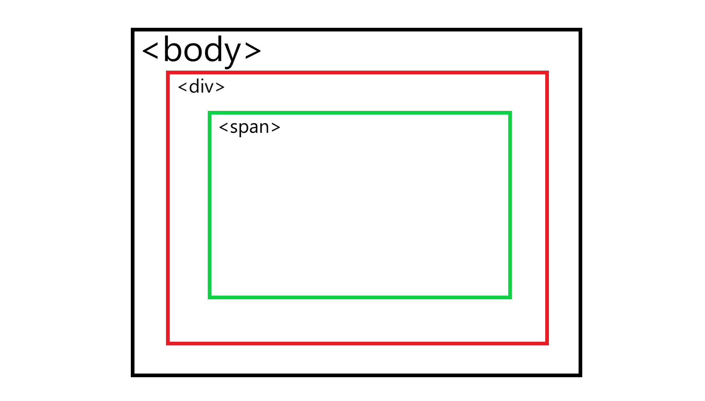

# Html Basic Grammar

오늘은 간단하게 html의 기본적인 문법과 태그들의 사용방식과 인라인요소 블록요소 그리고 부모요소와 자식의 요소가 무엇인지 알아보았습니다.

## Html basic Grammar

html는 다양한 태그들로 구성 되어 있고 어제 배웠던 html의 기본적인 구조 head와 body를 구분하여 배웠다. 오늘은 이 태그들을 사용하는 용법에 대해서 배웠다.

> `<tagName attribute="value">content</tagName>`

위의 간단한 html tag 예제로 어떤 것이 명칭이며 무엇이 있는지 알아보았다.

- 태그(tag) `<tagName attribute="value">content</tagName>` 꺾쇠로 열려있는 그 자체를 의미하며 태그를 열었다면 반드시 닫는 태그로 닫아주어야 후에 에러가 발생하지 않는다. 정확하게는 닫지 않아도 되는 경우도 있지만 웬만하면 지금부터 태그를 열었다면 반드시 닫아야 하는 습관을 가지자.
- 요소(Elements) `<tagName>content</tagName>` 이 내용 그 자체를 요소라고 부른다.
- 내용(Content) `<tagName>content</tagName>` 태그안에 있는 실질적인 내용을 의미한다.
- 속성(Attribute) `<tagName attribute="value">content</tagName>` html 태그의 상세한 정보 예를 들어서 후에 배울 class나 id 그리고 다양한 정보들을 담을 수 있게 도와주는 속성이다. 일부 태그(img 등)는 반드시 속성을 가져야 하는 경우도 있는데, 이를 필수 속성이라고 부른다.

위의 4가지가 기본적으로 html의 태그를 구성하는 내용이다. 위에서 언급을 했다 싶이 태그를 열었다면 반드시 닫는 것이 권장되는데 태그를 닫지 않아도 되는 경우가 있다. 바로 빈 태그인 경우이다.

### 빈 태그?

빈 태그는 말그대로 내용이 없는 태그이며 내용을 적지 않는 태그라고 할 수 있다. 아주 간단한 예시로 이미지 태그를 예를 들을 수 있다.

`` 이 이미지 태그는 `</img>` 이런 형태가 아닌 오직 하나의 태그로 그 내용을 담고 있다. 하지만 이렇게 되면 한가지 오류가 발생하는데 바로 태그를 열고 닫지 않았기 때문에 그 내용이 없는데 이를 해결 하는 것이 바로 필수속성이다.

앞에서도 언급을 했다 싶이 일부 태그는 반드시 속성을 가져야 하는 필수 속성이 있다고 했는데 바로 이 경우이다. 만약 필수속성을 빠트렸다면 화면에는 아무것도 출력이 되지 않을 것이다.

## 인라인 요소? 블록 요소??

인라인 요소와 블록 요소를 처음 들었을 때는 어떤 것인지 감을 잡기가 힘들 것이다. 왜냐면 개념 자체가 조금 생소하기 때문이다. 하지만 두가지의 예시를 보게 된다면 어떤 것이 인라인 요소인지 단번에 알 수 있게 될 것이다.

1. 인라인 요소는 글자를 담는 요소이다. 인라인 요소는 글자의 그 자체를 의미 하며 대표적인 인라인 요소는 `<span>Content</span>` span 태그가 있다.
   span tag는 하나의 글자의 요소 이기 때문에 세로로 계속 나열되게 된다. 밑의 사진은 블록요소와 인라인요소의 차이점을 비교한 사진이다. 인라인 요소는 굉장히 중요한 성질을 가지는데, 내용의 가로와 세로의 크기가 해당하는 내용 사이즈에 알아서 줄어들게 된다.

> 
> 출처: https://codeburst.io/block-level-and-inline-elements-the-difference-between-div-and-span-2f8502c1f95b

2. 블록 요소는 인라인 요소와 정반대의 성질을 가지고 있다. 블록 요소의 대표주자는 바로 `<div></div>` div 태그이다. div태그는 하나의 글자보다는 컨텐츠의 영역을 나타내는데 주료 사용되며 원래는 아무것도 나타내지 않는 요소이다.
   이 블록 요소는 인라인 요소와는 다른 점을 가지고 있는데 바로 내용의 가로의 크기는 컨텐츠의 맞춰서 줄어들지만 세로는 최대한 늘릴 수 있는 데 까지 늘리는 것이 특징이다.

이 블록 요소와 인라인 요소를 적절히 사용하여 페이지를 구성을 하는 것이 매끄럽게 웹사이트를 제작하는 비결이라고 할 수 있다. 그리고 둘의 특징이 있는데 그것은 바로 인라인 요소안에 블록 요소를 넣을 수는 없다.

```html
<span>
  <div>불가능함!</div>
</span>

<span>
  <span>가능함!</span>
</span>
```

## 부모요소? 자식요소??

부모 요소와 자식의 요소를 처음 들었을 때는 어떤 말인지 감을 잡기 힘들 수 있다. 부모 요소와 자식의 요소는 사실 간단한 개념이다.

```html
<div><- 부모요소
  <div><- 자식요소</div>
</div>
```

위의 코드와 같이 설명을 할 수 있는데 부모요소는 말그대로 태그 위에 있는 태그 즉 상위 요소임을 나타낸다. 자식요소는 바로 부모요소를 가진 하위의 요소를 나타낸다.
부모 요소와 자식 요소는 서로 다른 상호적인 개념이며 부모요소는 자식요소일수도 자식요소는 부모 요소 일 수도 있다. 이는 아래의 예제를 보면 이해를 할 수 있다.

```html
<body><- div 태그의 부모요소
  <div><- body 태그의 자식요소 이면서도 span 태그의 부모요소
    <span></span><- div 태그의 자식요소
  </div>
</body>
```
> 
위의 코드를 간략하게 그림으로 표현

이 부모 요소와 자식요소의 중요성은 후에 다루게 될 css에서 조금더 자세하게 다루겠다.

----
#### 정리하면서 느낀점
원래는 내가 따로 학습을 해서 아는 내용이었지만 또 내가 아는 내용 이였기 떄문에 업신 여기고 또 다시 복습을 하지 않아도 되는 내용인줄 알았지만 이렇게 다시 배워보고 또 다시 TIL로 정리르 해보면서 느낀 점은 내가 아는 지식이라고 해도 아직 모르는 부분이 있고 또 내가 알고 있다고 해서 다시 되돌아 보거나 복습을 하지 않았는지 제 자신을 스스로 되돌아 보고 창피함을 느끼게 되었습니다... TIL 열심히 해야겠다!